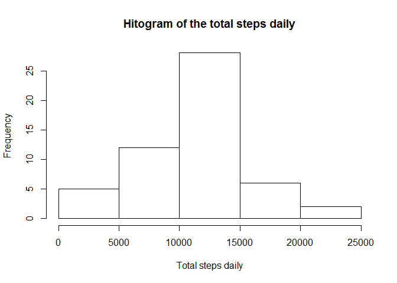
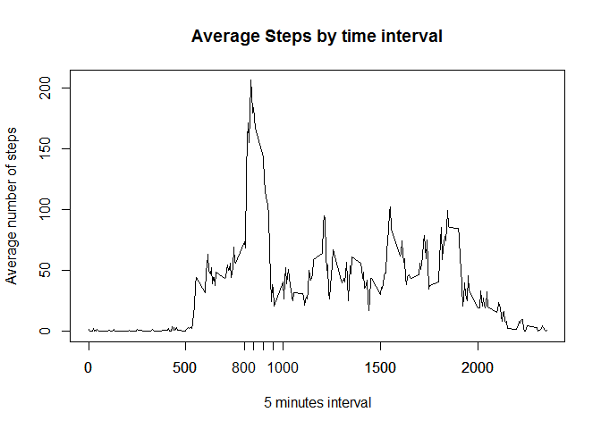
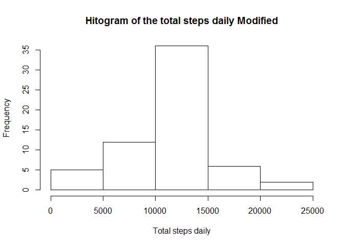
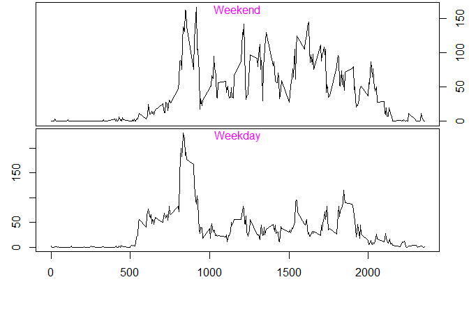

# Reproducible Research: Peer Assessment 1


## Loading and preprocessing the data

```r
activity<-read.csv("Activity.csv")
AggregByDate <- aggregate(activity$steps, list(activity$date),sum)
```

## What is mean total number of steps taken per day?

```r
Mean1<- mean(AggregByDate$x, na.rm=TRUE)
Median1<- median(AggregByDate$x, na.rm=TRUE)
```

Here the characteristics of the total number of the steps made daily

  - Mean = 1.0766189\times 10^{4}
  - Median = 10765
  
 

## What is the average daily activity pattern?

```r
AggregByInterval <- aggregate(activity$steps, list(activity$interval),mean, na.rm=TRUE)
names(AggregByInterval)[names(AggregByInterval)=="Group.1"] <- "TimeInterval"
names(AggregByInterval)[names(AggregByInterval)=="x"] <- "Steps"

plot(AggregByInterval$Steps~AggregByInterval$TimeInterval, type="l",  axes=FALSE, ylab="Average number of steps", xlab="5 minutes interval", main="Average Steps by time interval")
axis(side=1, at=c(seq(0,800, by=500), seq(800,1000, by=50), seq(1000,2400, by=500)))
axis(side=1,at=seq(0,2400,by=500))
axis(side=2)

box()
```

 

Based on the plot we can see that the maximum activity is happening between 8 and 9 AM

```r
AggregByInterval[AggregByInterval$TimeInterval >= 800 & AggregByInterval$TimeInterval <= 900,]
```

```
##     TimeInterval     Steps
## 97           800  73.37736
## 98           805  68.20755
## 99           810 129.43396
## 100          815 157.52830
## 101          820 171.15094
## 102          825 155.39623
## 103          830 177.30189
## 104          835 206.16981
## 105          840 195.92453
## 106          845 179.56604
## 107          850 183.39623
## 108          855 167.01887
## 109          900 143.45283
```

The maximum activity is happening between 8:30 and 8:35 AM

## Imputing missing values

```r
NACount<-nrow(activity[is.na(activity$step),])
```

Number of the rows with NA number of steps in the original data set is: 2304

We will replace them with the avarage number of steps for the same interval calculated through the whole data set


```r
activityM<-activity
activityM$steps[is.na(activityM$steps)]<-AggregByInterval$Steps[match(AggregByInterval$TimeInterval, activityM$interval)]
AggregByDateM <- aggregate(activityM$steps, list(activityM$date),sum)
MeanM1<- mean(AggregByDateM$x, na.rm=TRUE)
MedianM1<- median(AggregByDateM$x, na.rm=TRUE)
```

Here the characteristics of the total number of the steps made daily

  - Mean Original = 1.0766189\times 10^{4}
  - Mean Modified = 1.0766189\times 10^{4}  
  - Median Original = 10765
  - Median Modified = 1.0766189\times 10^{4}  
  
 
The elimination of the NA slightly modified Median value of the steps taken daily but did not affect Mean value of the steps taken daily

## Are there differences in activity patterns between weekdays and weekends?


```r
activityM$isWeekend<-ifelse(weekdays(as.Date(activityM$date, "%Y-%m-%d"), abbreviate=TRUE) == "Sun"|weekdays(as.Date(activityM$date, "%Y-%m-%d"), abbreviate=TRUE) == "Sat", "Y", "N")

AggregByIntervalMWd <- aggregate(activityM$steps[activityM$isWeekend=="Y"], list(activityM$interval[activityM$isWeekend=="Y"]),mean, na.rm=TRUE)
AggregByIntervalMWy <- aggregate(activityM$steps[activityM$isWeekend=="N"], list(activityM$interval[activityM$isWeekend=="N"]),mean, na.rm=TRUE)
```

Plot below shows the difference in average activity by time of the day between weekdays and weekends


```r
par(mfrow=c(2,1), oma = c(6,0,0,2) + 0.1,
          mar = c(0,2.5,0,0) + 0.1) 
plot(AggregByIntervalMWd$x~AggregByIntervalMWd$Group.1, type="l",  axes=FALSE)
axis(side=3, xaxt='n')
axis(side=4)
mtext("Weekend",side=3,line=-1, col="magenta")


box()
plot(AggregByIntervalMWy$x~AggregByIntervalMWy$Group.1, type="l",   axes=FALSE, xlab="Interval")     
axis(side=1)
axis(side=2)
mtext("Weekday",side=3,line=-1, col="magenta")
title(xlab="Interval")
box()
```

 
